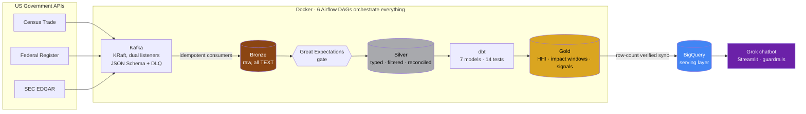

# 🔌 Silicon Signals

### Supply chain intelligence for the semiconductor industry, built entirely on free public data.


**Why this name:** the platform turns three streams of raw government data into three kinds of signals. Trade signals (who ships what, and how concentrated that is), regulatory signals (what happens when export rules change), and company signals (what supplier financials are quietly saying). Silicon is the domain. Signals is the job.

**The problem it solves:** every company that depends on chips has the same blind spot. Which countries does our supply actually come from, and what happens to those flows when Washington changes the rules? The answers live in public US government data. Census publishes every import dollar, the Federal Register publishes every rule, the SEC publishes every filing. What is missing is the pipeline that makes them talk to each other. This repo is that pipeline.

Ask it a question in plain English:

> **"How dependent are we on a single country for memory chips right now?"**
>
> 🤖 *The top supplier alternates between Taiwan and South Korea, holding between 36% and 58% of monthly US memory chip supply. HHI values sit between 2,328 and 3,832, which is highly concentrated territory for most months.*

Nobody wrote that answer. A chatbot generated the SQL, a guardrail vetted it, and BigQuery ran it against marts a dbt job rebuilt this morning, on data Kafka pulled from three government APIs on a schedule.

---

## Architecture



Every tool earns its seat. Kafka decouples flaky government APIs from the database and gives me replay for free. Bronze stores exactly what the API sent, all TEXT, because Bronze is an evidence locker, not a database with opinions. Silver is where types, filters, and quarantine happen. dbt owns Silver to Gold because transforms belong in version control with tests. Great Expectations gates Bronze promotion with statistical checks dbt tests cannot express. BigQuery exists so the chatbot queries a cloud serving layer instead of my laptop.

Nothing here is a resume sticker. I dropped Power BI from the original plan because a dashboard would have been exactly that.

## Who asks it what

| Persona | Their question | Where the answer lives |
|---|---|---|
| Procurement manager | How dependent are we on one country for memory chips, and is it getting better or worse? | `mart_hhi_concentration`, now with the top supplier named per month |
| Trade compliance analyst | When the October 2022 export controls landed, what actually happened to imports the next quarter? | `mart_regulatory_impact`, 3 month before and after windows per rule |
| Strategy analyst | Are our suppliers building inventory faster than revenue is growing? | `mart_company_signals`, revenue and inventory YoY side by side |

## What the data actually says

| 📊 Finding | Evidence |
|---|---|
| US processor import concentration nearly **quadrupled** into the chip shortage era | HHI (HS 854231): 1,037 in 2010, then **4,718** in 2020, easing to about 2,233 today. The DOJ calls anything above 2,500 highly concentrated. This metric would have flagged the fragility before the 2021 crisis. |
| The Oct 13, 2022 export controls preceded a real trade drop | US memory chip imports: **down 29.7%** in the 3 months after versus before. Processors: down 13.2%. The Dec 2022 follow up rule: down another 25%. |
| Demand can drown the policy signal | April 2024: processor imports **up 34%** despite fresh restrictions. The AI boom ate the regulation. Every impact number here is labeled a correlation window for exactly this reason. The platform surfaces correlation, the analyst judges causation. |
| Memory is today's most concentrated category | HHI 3,330 versus 2,233 for processors, with Taiwan and South Korea trading the top supplier spot. The chatbot surfaced this one. I did not go looking for it. |

## Receipts 🧾

Claiming a pipeline works is easy. Here is what I can demonstrate on demand:

<details>
<summary><b>Exactly-once semantics, proven by replay</b></summary>

I reset the consumer group offsets to zero and replayed the entire topic against a full Bronze table:

```
Consumed: 76,311 | Inserted: 0 | Duplicates skipped: 76,311
```

At-least-once delivery plus idempotent writes against a unique constraint gives you effectively exactly-once. Every drain task in every DAG leans on this. Retries, SIGTERMs, and panic clicking cannot corrupt the data. I know because all three happened.
</details>

<details>
<summary><b>The pipeline audits itself to 0.00%</b></summary>

The Census API ships a TOTAL row per code and month. Most pipelines would filter it out and move on. Mine filters it into a reconciliation table, and an hourly Airflow task compares the sum of all countries against the government's own total.

Result across all **980 code-months since 2010: 0.00% variance.** Sixteen years of API to Kafka to Bronze to Silver, and not a dollar lost. The check runs hourly and fails the DAG at any drift beyond 1%.
</details>

<details>
<summary><b>The quality gate actually gates</b></summary>

A gate that never fired is decoration. So I corrupted one Bronze value on purpose, writing 'CORRUPTED' where 84355584 belonged:

```
GE checkpoint: success=False, expectations=9, failed=1
  FAILED: expect_column_values_to_match_regex on trade_value_usd
```

Red, named culprit, Silver promotion blocked. Restored the true value from the API, re-ran, green. Both directions, on record.
</details>

<details>
<summary><b>The chatbot cannot be weaponized</b></summary>

Generated SQL is untrusted input. It passes a guardrail: SELECT only, forbidden keyword scan (including a DELETE smuggled after a semicolon), table allowlist, LIMIT bolted on if missing. Eight pytest cases cover the guardrail and run in CI on every PR. Ask it to delete the trade data and it refuses at two independent layers.
</details>

<details>
<summary><b>CI blocks bad merges, including mine</b></summary>

Every PR runs ruff, sqlfluff, 13 pytest cases, and dbt parse on GitHub's machines, with branch protection making a red ✗ physically unmergeable. The linter once caught three undefined names from a refactor I thought I had finished. The robot was right.
</details>

## My favorite bug 🐛

The chatbot answered "which company leads the semiconductor business?" with NVDA at $215.9B revenue. Sounds great. Completely wrong.

That $215.9B was NVIDIA's full fiscal year, ranked against other companies' single quarters. Digging in: SEC XBRL facts carry a start and an end date, and my EDGAR producer had only kept the end. Quarterly, nine month year-to-date, and annual values were living in one column like they were the same thing.

The fix touched all six layers: duration classification at the producer (75 to 105 days is a quarter, 350 to 380 is a fiscal year, YTD gets discarded entirely), a period_type column through Bronze and Silver, widened unique constraints, a re-pivoted mart with quarterly and fiscal year revenue honestly separated, a re-synced serving layer, and an updated schema prompt so the chatbot knows the difference.

The serving layer caught a bug in the ingestion layer. That is the whole argument for owning a pipeline end to end, in one anecdote. It happened twice more after that: a user question exposed that the HHI mart never named the top supplier, and another exposed that inventory growth had no YoY column to compare against revenue. Both fixed in dbt within minutes. The chatbot turned out to be the best QA tool the marts ever had.

## What I would tell you in a design review (limitations)

- **Correlation is not causation**, and the 2024 data proves confounders exist. Labeled accordingly everywhere.
- **TSM and GFS** file annually under IFRS with no matching capex tags. Documented coverage gaps, their revenue lives in the fiscal year column.
- **Census is country level.** Firm level trade is confidential, which is exactly why EDGAR is a separate source.
- **Dev shortcuts, named:** no Airflow Fernet key yet, so connection secrets sit unencrypted at rest, and three near identical consumers want to become one parameterized module.

## By the numbers

|  |  |
|---|---|
| 📦 Trade records (2010 to 2026, 5 HS codes, 215 countries) | **76,311** |
| 📜 BIS regulatory documents (2002 to present) | **2,968** |
| 💰 Company financial facts (10 tickers, Q / FY / INSTANT classified) | **1,416** |
| 🔀 Airflow DAGs / dbt models / dbt tests | 6 / 7 / 14 |
| ✅ pytest cases in CI | 13 |
| 🎯 Reconciliation variance | **0.00%** |

## Run it

```bash
cp .env.example .env        # your keys: Census, SEC user agent, GCP, xAI
docker compose up -d        # Kafka + Postgres + Airflow (custom image, boots in seconds)
# http://localhost:8080 and unpause the DAGs
streamlit run chatbot/app.py
```

Secrets live in .env and secrets/, both gitignored. I learned this the hard way in week one when an API key hit a public commit. Revoked it, rewrote history, and wrote the rule into the workflow: secrets before code, every time.
