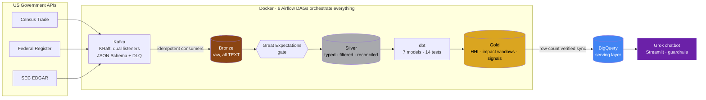

# 🔌 Semiconductor Supply Chain Intelligence Platform


Ask it a question in plain English:

> **"What happened to memory chip imports after the October 2022 export controls?"**
>
> 🤖 *Memory chip imports fell sharply after the October 2022 export controls. The 3-month average dropped from $280.3M before to $197.0M after — a **−29.7%** change.*

Nobody wrote that answer. A chatbot generated SQL, a guardrail vetted it, BigQuery ran it against marts a dbt job rebuilt this morning, on data Kafka pulled from three US government APIs on a schedule. This repo is the whole machine, end to end.

---

## Why I built this

In 2021 a shortage of chips that cost less than a coffee froze 169 industries and burned $100B+ in the auto sector alone. In October 2022, one Federal Register document rewired the global chip trade overnight.

Companies pay Resilinc and Interos six figures a year to answer three questions:

1. How dependent are we on one country for critical components?
2. When export rules change, what actually happens to trade flows?
3. What are key suppliers' financials signaling?

Here's the thing that bugged me: all three are answerable from **free public data**. Census publishes every import dollar. The Federal Register publishes every rule. The SEC publishes every filing. What's missing is the pipeline. So I built the pipeline.

## Architecture



Every tool earns its seat. Kafka decouples flaky government APIs from the database and gives me replay for free. Bronze stores *exactly* what the API sent, all TEXT, because Bronze is an evidence locker, not a database with opinions. Silver is where types, filters, and quarantine happen. dbt owns Silver→Gold because transforms belong in version control with tests. GE gates Bronze promotion with statistical checks dbt tests can't express. BigQuery exists so the chatbot queries a cloud serving layer instead of my laptop.

Nothing here is a resume sticker. I dropped Power BI from the original plan because a dashboard would've been exactly that.

## What the data actually says

| 📊 Finding | Evidence |
|---|---|
| US processor-import concentration nearly **quadrupled** into the chip-shortage era | HHI (HS 854231): 1,037 in 2010 → **4,718** in 2020 → ~2,233 today. DOJ calls >2,500 "highly concentrated." This metric would have flagged the fragility *before* the 2021 crisis. |
| The Oct 13, 2022 export controls preceded a real trade collapse | Memory chips: **−29.7%** in the 3 months after vs before. Processors: −13.2%. The Dec 2022 follow-up rule: −25% more. |
| Demand can drown the policy signal | April 2024: processor imports **+34%** despite fresh restrictions. The AI boom ate the regulation. Which is why every impact number here is labeled a *correlation window* — the platform surfaces correlation, the analyst judges causation. |
| Memory is today's most concentrated category | HHI 3,330 vs 2,233 for processors. The chatbot surfaced this one — I didn't go looking for it. |

## Receipts 🧾

Claiming a pipeline works is easy. Here's what I can demonstrate on demand:

<details>
<summary><b>Exactly-once semantics, proven by replay</b></summary>

I reset the consumer group's offsets to zero and replayed the entire topic against a full Bronze table:

```
Consumed: 76,311 | Inserted: 0 | Duplicates skipped: 76,311
```

At-least-once delivery + idempotent writes against a unique constraint = effectively exactly-once. Every drain task in every DAG leans on this — retries, SIGTERMs, and panic-clicking cannot corrupt the data. I know because all three happened.
</details>

<details>
<summary><b>The pipeline audits itself to 0.00%</b></summary>

The Census API ships a TOTAL row per code-month. Most pipelines would filter it out and move on. Mine filters it *into a reconciliation table*, and an hourly Airflow task compares `SUM(all countries)` against the government's own total.

Result across all **980 code-months since 2010: 0.00% variance.** Sixteen years of API → Kafka → Bronze → Silver, and not a dollar lost. The check runs hourly and fails the DAG at >1% drift.
</details>

<details>
<summary><b>The quality gate actually gates</b></summary>

A gate that never fired is decoration. So I corrupted one Bronze value on purpose (`'CORRUPTED'` where `84355584` belonged):

```
GE checkpoint: success=False, expectations=9, failed=1
  FAILED: expect_column_values_to_match_regex on trade_value_usd
```

Red, named culprit, Silver promotion blocked. Restored the true value from the API, re-ran, green. Both directions, on record.
</details>

<details>
<summary><b>The chatbot can't be weaponized</b></summary>

Generated SQL is untrusted input. It passes a guardrail: SELECT-only, forbidden-keyword scan (yes, including a DELETE smuggled after a semicolon), table allowlist, LIMIT bolted on if missing. Eight pytest cases cover the guardrail and run in CI on every PR. Ask it to `Delete all the trade data` and it refuses at two independent layers.
</details>

<details>
<summary><b>CI blocks bad merges — including mine</b></summary>

Every PR: ruff + sqlfluff + 13 pytest cases + `dbt parse`, on GitHub's machines, with branch protection making a red ✗ physically unmergeable. The linter once caught three undefined names from a refactor I thought I'd finished. The robot was right.
</details>

## My favorite bug 🐛

The chatbot answered *"which company leads the semiconductor business?"* with **"NVDA: $215.9B revenue."** Sounds great. Completely wrong.

$215.9B was NVIDIA's *full fiscal year*, ranked against other companies' *single quarters*. Dug in: SEC XBRL facts carry a `start` and an `end` date, and my EDGAR producer had only kept `end` — so quarterly, nine-month-YTD, and annual values were living in one column like they were the same thing.

The fix touched all six layers: duration classification at the producer (75–105 days = quarter, 350–380 = fiscal year, YTD discarded entirely), a `period_type` column through Bronze and Silver, widened unique constraints, a re-pivoted mart with `revenue_usd` (quarterly) and `revenue_fy_usd` honestly separated, a re-synced serving layer, and an updated schema prompt so Grok knows the difference.

The serving layer caught a bug in the ingestion layer. That's the whole argument for owning a pipeline end to end, in one anecdote.

## What I'd tell you in a design review (limitations)

- **Correlation ≠ causation**, and the 2024 data proves confounders exist. Labeled accordingly everywhere.
- **TSM and GFS** file annually under IFRS with no matching capex tags — documented coverage gaps, their revenue lives in the FY column.
- **Census is country-level.** Firm-level trade is confidential — which is exactly why EDGAR is a separate source.
- **Dev shortcuts, named:** no Airflow Fernet key yet (connection secrets unencrypted at rest), three near-identical consumers that want to be one parameterized module.

## By the numbers

|  |  |
|---|---|
| 📦 Trade records (2010→2026, 5 HS codes, 215 countries) | **76,311** |
| 📜 BIS regulatory documents (2002→present) | **2,968** |
| 💰 Company financial facts (10 tickers, Q/FY/INSTANT) | **1,416** |
| 🔀 Airflow DAGs / dbt models / dbt tests | 6 / 7 / 14 |
| ✅ pytest cases in CI | 13 |
| 🎯 Reconciliation variance | **0.00%** |
| 💸 Total cash spent | **~$10** (xAI credits · GCP free tier behind a $1 budget alarm) |

## Run it

```bash
cp .env.example .env        # your keys: Census, SEC user agent, GCP, xAI
docker compose up -d        # Kafka + Postgres + Airflow (custom image, deps baked in, boots in seconds)
# http://localhost:8080 → unpause the DAGs
streamlit run chatbot/app.py
```
